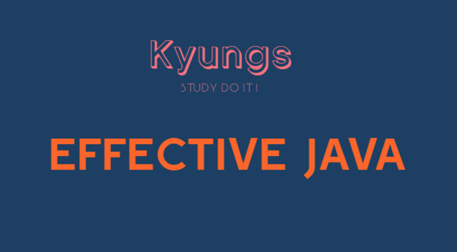

# effective_java

## 목차 
- [Ch2 - Creating and Destroying Objects](./ch2/)
- [Ch3 - Methods Common to All Objects](./ch3/)
- [Ch4 - Clasases and Interfaces](./ch4/)
- [Ch5 - Generics](./ch5/)
- Ch6 - Enums and Annotations
- Ch7 - Lambdas and Streams
- Ch8 - Methods
- Ch9 - General Programming
- Ch10 - Exceptions
- Ch11 - Concurrency
- Ch12 - Serialization